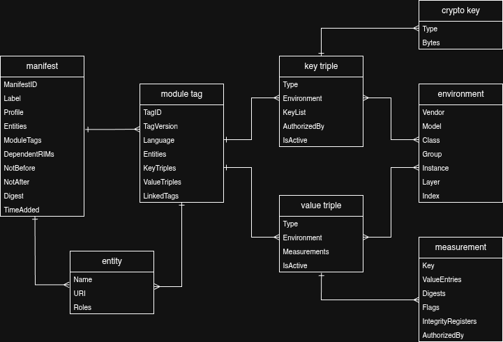
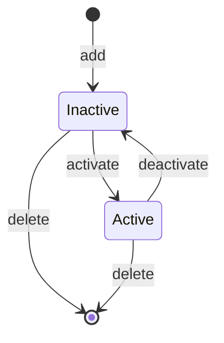

This is an implementation of an endorsement and reference value store
implemented on top of a relational DBMS, and supporting [CoRIM] inputs.

[CoRIM]: https://datatracker.ietf.org/doc/draft-ietf-rats-corim/

## API

```go
import (
    "context"
    "fmt"
    "log"
    "os"

	"github.com/veraison/corim-store/pkg/model"
	"github.com/veraison/corim-store/pkg/store"
)

func main() {
    // create and initialize the store.

    cfg := store.NewConfig("sqlite", "file::memory:?cache=shared")

    store, err := store.Open(context.Background(), cfg)
    if err != nil {
        log.Fatal(err)
    }

    if err := store.Init(); err != nil {
        log.Fatal(err)
    }

    // Read a CoRIM and add it to the store.

    corimBytes, err := os.ReadFile("sample/corim/unsigned-cca-ref-plat.cbor")
    if err != nil {
        log.Fatal(err)
    }

    if err := store.AddBytes(corimBytes, "cca"); err != nil {
        log.Fatal(err)
    }

    // Query the store for a trust anchor associated with an instance ID.

    env = model.Environment {
        InstanceBytes: []byte{
            0x01, 0x07, 0x06, 0x05, 0x04, 0x03, 0x02, 0x01,
            0x00, 0x0f, 0x0e, 0x0d, 0x0c, 0x0b, 0x0a, 0x09,
            0x08, 0x17, 0x16, 0x15, 0x14, 0x13, 0x12, 0x11,
            0x10, 0x1f, 0x1e, 0x1d, 0x1c, 0x1b, 0x1a, 0x19,
            0x18,
    }

    keyTriples, err := store.GetKeyTriples(&env, "cca", false)
    if err != nil {
        log.Fatal(err)
    }

    fmt.Printf("key: %s\n", string(keyTriples[0].KeyList[0].KeyBytes))
}
```

## CLI

This repo includes a CLI tool, `corim-store`, for interacting with the store.
Use `-h`/`--help` option to view available commands and their arguments.

### Example flow

```bash
./corim-store db init
```
Initialize the database for use with the store.

```bash
./corim-store db status
```
Show the database connection settings and current migration status. This can be
used to make sure that the database is up-to-date with what the store expects.
This should be run after updating to the latest version of the store. If new
migrations are available, the database can be updated by re-running the
`migrate` (but not `init`!) command.

```bash
./corim-store corim add sample/corim/*.cbor
```
Add sample CoRIM's to the store.

```bash
./corim-store list module-tags
```
List module tags (CoMID's) inside the store.

```bash
./corim-store get --class-id 2QJYWCB/RUxGAgEBAAAAAAAAAAAAAwA+AAEAAABQWAAAAAAAAA
```
Get endorsements associated with the specified class ID from the store.

```bash
./corim-store corim dump cca-ref-plat -o /tmp/cca-platform-ref-vals.cbor
```
Write the contents associated with the specified manifest ID (here,
`cca-ref-plat`) to file as an unsigned CoRIM.

### Configuration

`corim-store` accepts configuration in YAML format. By default, configuration
is read from `~/.config/corim-store.yaml` if it exists. An alternative file
can be specified with `--config` command line option.

The following settings are accepted:

- `dbms`: The DBMS backing the store. Accepted values are `sqlite`, `postgres`,
  and `mysql` (TODO: currently, only `sqlite` is supported). The default is
  `sqlite`.
- `dsn`: The Data Source Name. This is the string used to connect to the
  database. The format depends on the DBMS (search the DBMS documentation for
  "data source name" or "connection string"). The default is
  `file:store:db?cache=shared`.
- `require-label`: A boolean value indicating whether a label MUST be specified
  for added endorsements. The default is `false`. (Note: without this flag,
  labels may still be specified; it is just that they are not _required_).
  Labels allow partitioning contained endorsements under different "namespaces"
  indicated by the label.
-  `hash-alg`: hashing algorithm used to calculate store-internal digests.
   (Note: this has no impact on the digests included inside
   endorsements/reference values). Accepted values are `md5`, `sha256`, and
   `sha512`. The default is `sha256`.
- `trace-sql`: A boolean value indicating whether to log executed SQL
  statements to STDERR. The default is `false`.
- `insecure`: A boolean value indicating whether insecure transactions (e.g.
  adding a signed CoRIM without verifying its signature) should be allowed. The
  default is `false`.
- `force`: A boolean value indicating whether to overwrite existing values. The
  default is `false`.
- `no-color`: A boolean value indicating whether colored output should be
  suppressed. The default is `false` (i.e. output is colored by default).

Each of the settings can also be specified via command-line options (the option
name is identical to the setting -- just prefix with `--`), or via environment
variables. To get then environment variable name, change the setting name to be
upper case, replace `-` with `_`, and prefix it with `CORIM_STORE_`. E.g. to
set `no-color` via an environment variable, you would set
`CORIM_STORE_NO_COLOR=1`.

## Store Design Overview

The store is intended for endorsements, reference values, and trust anchors
that will be used for attestation verification. These are stored as value and
key triples, which associate an attesting environment description with
corresponding measurements and cryptographic keys.

Sets of triples are grouped under "module tags" (corresponding to CoMIDs),
which are, in turn, associated with "manifests" (corresponding to CoRIMs).
Module tags group claims (contained in triples) relating to a logical system
module (hardware, firmware, etc). A manifest acts as an "envelope" containing
additional metadata about the module tags it contains (such as the validity
period).



The above diagram is a simplified entity-relation diagram for the major
entities used by the store. It omits some "meta" fields (e.g. foreign keys),
and only shows the main logical entities within the store. For a complete
overview of the SQL tables created by the store, please see the [schema
diagram](misc/corim-store-schema.drawio.png).

### Triple Life Cycle

By default, when triples are added, they are in an inactive state. They must be
activated in order to become available for use in verification. This decouples
provisioning values into the store from making them available for verification.
Triples may also be deactivated (e.g. when the associated attesters have been
decommissioned), but remain "archived" in the store.


